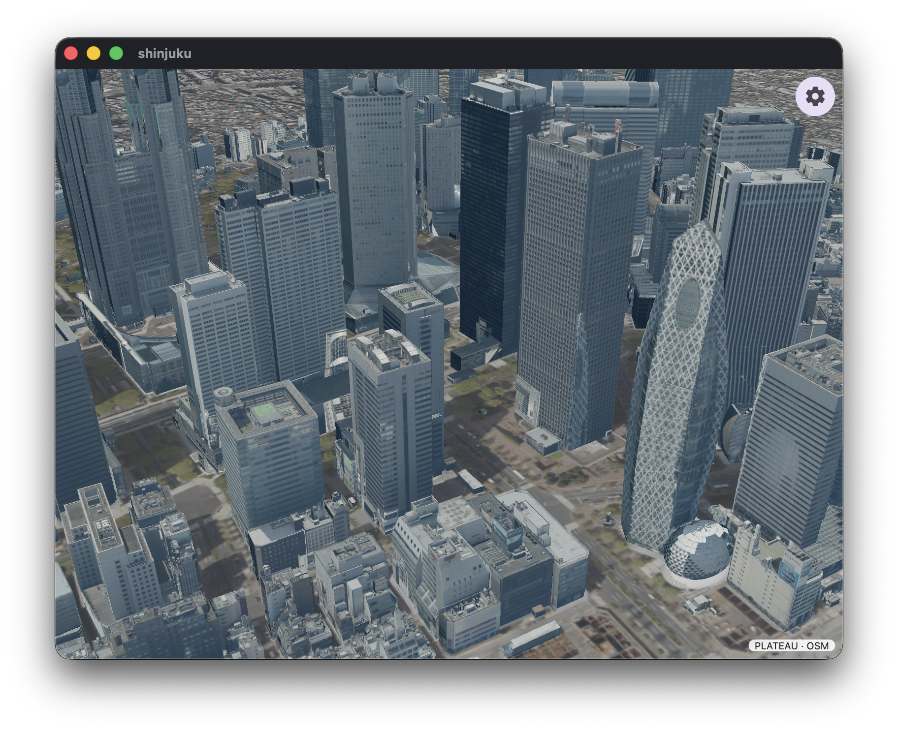

# Shinjuku 3D Map

Project PLATEAU's textured 2025 LOD2 buildings for Shinjuku, rendered with
MapLibre Flutter GPU.

The app decodes B3DM/glTF meshes, Draco geometry, and WebP textures at runtime,
then draws them with a custom Flutter GPU shader pipeline.

## Related

- [Project PLATEAU](https://www.mlit.go.jp/plateau/)
- [Shinjuku 3D city model (2025)](https://www.geospatial.jp/ckan/dataset/plateau-13104-shinjuku-ku-2025)
- [PLATEAU 3D Tiles specification](https://docs.plateauview.mlit.go.jp/datasets/3d-tiles/)
